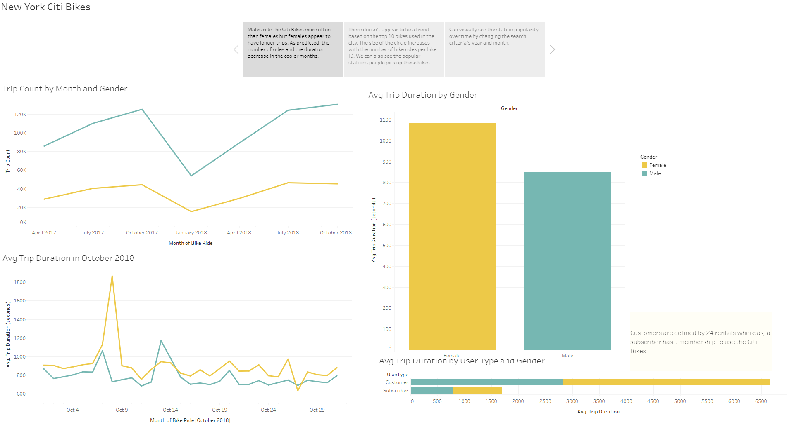
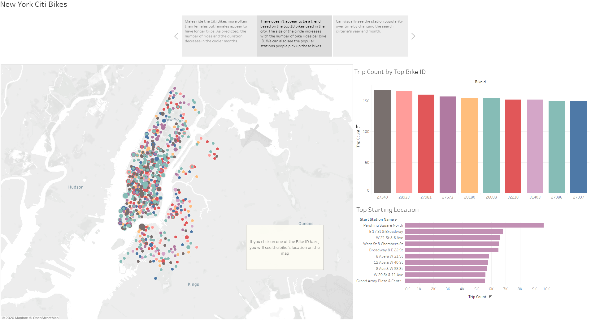
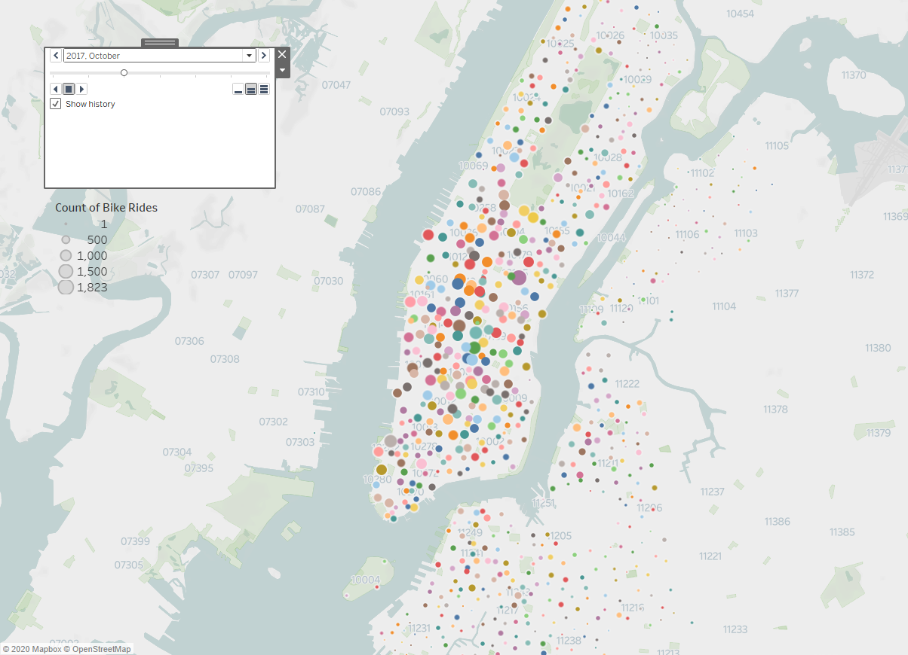

# New-York-Citi-Bikes

Aggregated the data found in the Citi Bike Trip History Logs, analyze sample data from 2017 and 2018. Using the data, created visuals analyzing the duration of trips and number of trips between males and females. Also looked at the popular locations in New York City to ride these bicycles and which bikes were most used. Then, able to see how the popularity grows over time. 

https://public.tableau.com/profile/taniya.chhabra#!/vizhome/CitiBikes_15997134925960/NewYorkCitiBikes

### Gender Analysis

The data we are looking at are sample sizes from 2017 and 2018. Based on the first dashboard, males appear to use the citi bikes more often in New York than females, but as one would assume, the number of trips by both genders decrease during the colder months. Using the line graphs, you can see that the most number of trips are in October of 2017 and 2018, we went a little more in depth, and saw that October 7th and 8th also have the longest trip durations by males and females. It is also interesting to see that the trip durations are higher for females, averaging about 18 minutes and 14 minutes for males. Anoter metric is the user type, there are customers (24 hour pass or 3 days pass) and subscribers (annual member), females account for more customers and subscribers than males. It looks like it is safe to say that the Citi Bikes are more popular with women than males in New Your City.

### Bike ID Analysis 

The second dashboard shows the top 10 bikes used in New York City. It was interesting to see that all the bikes appear to move throughout the city instead of staying in one particular area, even though, we saw on the last dashboard, that the average bike rides are between 14-18 minutes. Using this graph, we are able to see which bikes are used most and likely needs an inspection or repair.

The data we are looking at are sample sizes from 2017 and 2018. You are able to change the Month and Year when analyzing the map. From the map, we can see that the magority of the Citi Bikes are used in the Manhattan area. We can see that the popularity of bikes varies with the season/month and not so much from 2017 to 2018. 

